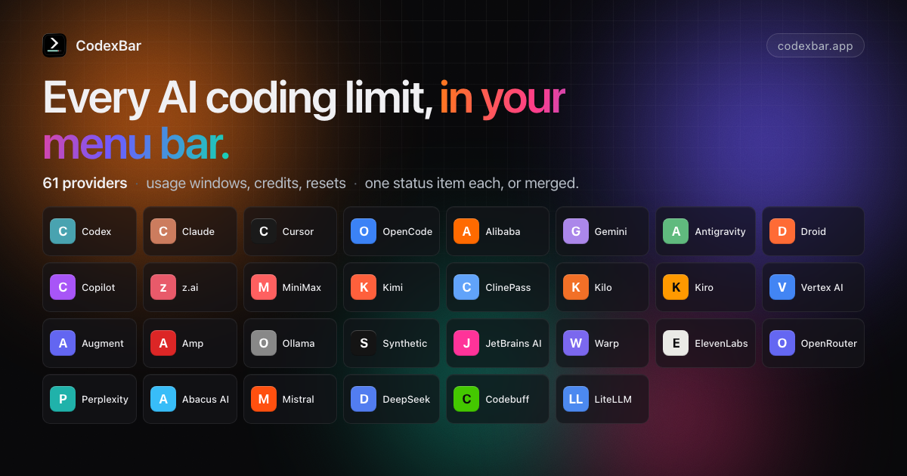

# CodexBar Ink

> An Android and BOOX e-ink companion dashboard for CodexBar.

[English](README.md) | [简体中文](README.zh-CN.md)

[](https://github.com/steipete/CodexBar)
[](Android/CodexBarInk)
[](Android/CodexBarInk)
[](LICENSE)

CodexBar Ink is a community fork of [CodexBar](https://github.com/steipete/CodexBar). It keeps the upstream macOS
menu bar app and CLI, and adds an always-on Android dashboard for phones and BOOX e-ink readers.

The reader fetches a display-oriented usage snapshot from CodexBar over the private LAN. Provider credentials stay on
the Mac; CodexBar Ink does not store Codex, Claude, or other provider passwords, cookies, or API tokens on Android.

> CodexBar Ink is still under development. There is currently no signed release APK; build it from source.

## CodexBar Ink

- Shows provider usage windows, including Codex weekly and Spark weekly limits.
- Draws daily usage and cost charts natively instead of using screenshot snapshots.
- Supports phone and reader aspect ratios, portrait and landscape layouts, and BOOX-specific refresh behavior.
- Uses high-contrast typography, partial refresh, and low-frequency updates for e-ink displays.
- Includes a focus timer that can keep the display awake while it is running.
- Shows weather from Open-Meteo, using device GPS when available and network location as a fallback. No API key is
  required.
- Follows the Android system language, with English and Simplified Chinese currently included.

## Quick start

### Requirements

- A Mac running CodexBar (macOS 14 or later).
- An Android 11 or later device.
- JDK 17, Android SDK, and `adb`.
- The Mac and Android device on the same private LAN.

### 1. Start the Mac Usage Host

In CodexBar, open **Settings > General** and enable **BOOX Usage Host**. Keep the Mac and reader on the same trusted
private network. The host is intended for local network use only; do not port-forward it or expose it to the public
Internet.

### 2. Build the Android APK

```bash
git clone https://github.com/ysimo0504/CodexBar.git
cd CodexBar/Android/CodexBarInk

JAVA_HOME=/path/to/jdk17 \
ANDROID_HOME=/path/to/android-sdk \
CODEXBAR_INK_DEFAULT_HOST=http://MAC_LAN_IP:43121 \
./gradlew :app:assembleSecureBooxDebug
```

For a standard Android phone without BOOX display APIs, use:

```bash
./gradlew :app:assembleSecureGenericDebug
```

`CODEXBAR_INK_DEFAULT_HOST` is a local build input and is not written back to the repository. You can also change the
host inside the app. The BOOX APK is written to:

```text
app/build/outputs/apk/secureBoox/debug/app-secure-boox-debug.apk
```

### 3. Install

```bash
adb install -r app/build/outputs/apk/secureBoox/debug/app-secure-boox-debug.apk
```

If BOOX firmware freezes newly installed third-party apps, unfreeze CodexBar Ink in BOOX App Management before
launching it. See [Android/CodexBarInk/README.md](Android/CodexBarInk/README.md) for build variants, tests, fixture
servers, and device-specific install notes.

### Android project layout

```text
Android/CodexBarInk/       Android and BOOX reader
Sources/CodexBar/          macOS menu bar app and Usage Host
Sources/CodexBarCLI/       CLI and dashboard snapshot generation
Sources/CodexBarCore/Ink/  private-LAN transport and snapshot boundary
```

The reader uses the versioned `GET /dashboard/v1/snapshot` display contract. See [docs/dashboard-api.md](docs/dashboard-api.md)
for the snapshot schema and the CLI `serve` transport/auth model.

## CodexBar for macOS 🎚️ — May your tokens never run out.

> Every AI coding limit, in your menu bar.

[](https://github.com/steipete/CodexBar/releases/latest)
[](https://github.com/steipete/CodexBar/releases/latest)
[](Integrations/Linux/README.md)
[](https://github.com/steipete/homebrew-tap)
[](https://aur.archlinux.org/packages/codexbar-cli)
[](LICENSE)
[](https://codexbar.app)

<a href="https://codexbar.app"></a>

Tiny macOS 14+ menu bar app that keeps **AI coding-provider limits visible** and shows when each window resets. Codex, OpenAI, Claude, Cursor, Gemini, Copilot, Grok, GroqCloud, ElevenLabs, Deepgram, z.ai, MiniMax, Kiro, Zed, Vertex AI, Augment, OpenRouter, LiteLLM, LLM Proxy, Codebuff, Command Code, ClinePass, AWS Bedrock, and many newer coding providers. One status item per provider, or Merge Icons mode with a provider switcher. No Dock icon, minimal UI, dynamic bar icons.

Also available as a [Linux desktop app](Integrations/Linux/README.md) with usage and spending windows, separate settings, desktop notifications, and an optional tray icon. On Omarchy, a native bar widget shares the desktop app’s data and follows your theme.


## Why

- **Plan around resets.** Per-provider session, weekly, and monthly windows with countdowns to the next reset — stop guessing whether to start that long task.
- **Credits, spend, and cost scans.** Credit balances, Admin API spend dashboards, provider billing summaries, and local cost scans where the source exposes enough detail.
- **Live status.** Provider status polling surfaces incident badges in the menu and an indicator overlay on the bar icon.
- **Privacy-first.** Reuses existing provider sessions — OAuth, device flow, API keys, browser cookies, local files — so no passwords are stored.

## Install

### macOS app

Requires macOS 14+ (Sonoma). Download from [GitHub Releases](https://github.com/steipete/CodexBar/releases), or install with Homebrew:

```bash
brew install --cask codexbar
```

### Linux desktop and Omarchy

The Qt 6 desktop app supports Wayland and X11, with an optional Omarchy widget.
Published desktop archives target x86_64 and ARM64 and require glibc 2.39+,
Qt 6.4+, and a separately installed CodexBar CLI. Python 3 runs the per-user installer.

Follow the [Linux installation guide](Integrations/Linux/README.md#install-release-archives)
for Arch/Omarchy, Fedora, and Debian/Ubuntu runtime packages, verified release
downloads, and upgrades. It keeps the CLI's resource bundle beside its executable
and installs a launcher and optional login startup. Open Settings to choose
providers, then authenticate through the provider's CLI or configure its API key.
GNOME may need a tray extension; the app's windows work without a tray.

See the [macOS feature comparison](Integrations/Linux/MAC_COMPARISON.md) for
supported features and remaining gaps.

### CLI Tarballs (macOS/Linux)
Homebrew formula (Linux today):
```bash
brew install steipete/tap/codexbar
```
Arch Linux AUR package:
```bash
yay -S codexbar-cli
```
Or download release tarballs from GitHub Releases:
- macOS: `CodexBarCLI-v<tag>-macos-arm64.tar.gz`, `CodexBarCLI-v<tag>-macos-x86_64.tar.gz`
- Linux (glibc): `CodexBarCLI-v<tag>-linux-aarch64.tar.gz`, `CodexBarCLI-v<tag>-linux-x86_64.tar.gz`
- Linux (static musl): `CodexBarCLI-v<tag>-linux-musl-aarch64.tar.gz`, `CodexBarCLI-v<tag>-linux-musl-x86_64.tar.gz`

### macOS first run
- Open Settings → Providers and enable what you use.
- Install/sign in to the provider sources you rely on: CLIs, browser sessions, OAuth/device flow, API keys, local app files, or provider apps depending on the provider.
- Optional: Settings → Providers → Codex → OpenAI cookies (Automatic or Manual) to add dashboard extras.

### Set API keys from the CLI
Provider toggles and API keys live in the resolved CodexBar config file. New installs use
`~/.config/codexbar/config.json`; existing `~/.codexbar/config.json` installs still load from the legacy path. You can
script the same provider list that Settings → Providers uses:

```bash
codexbar config providers
codexbar config enable --provider grok
codexbar config disable --provider cursor
```

For API-key providers, store a key without opening Settings:

```bash
printf '%s' "$ELEVENLABS_API_KEY" | codexbar config set-api-key --provider elevenlabs --stdin
```

`set-api-key` trims the piped value, stores it with restrictive config-file permissions, and enables the provider by default. Use `--no-enable` to only save the key, or `--api-key <key>` for one-off local scripts where shell history is not a concern.
See [CLI configuration](docs/cli-configuration.md) for the full flow.

## Providers

- [Codex](docs/codex.md) — OAuth API or local Codex CLI, plus optional OpenAI web dashboard extras.
- [OpenAI](docs/openai.md) — Admin API key usage/cost graphs with legacy credit-balance fallback.
- [Azure OpenAI](docs/azure-openai.md) — API key, endpoint, and deployment validation probe.
- [Claude](docs/claude.md) — OAuth API, browser cookies, or CLI PTY fallback; session and weekly usage where available.
- [Cursor](docs/cursor.md) — Browser session cookies for plan + usage + billing resets.
- [OpenCode](docs/opencode.md) — Browser cookies for workspace subscription usage.
- [OpenCode Go](docs/opencode.md) — Usage API, browser fallback, and local SQLite cost history.
- [Alibaba Coding Plan](docs/alibaba-coding-plan.md) — Web cookies or API key for coding-plan quotas.
- [Alibaba Token Plan](docs/alibaba-token-plan.md) — Bailian browser/manual cookies for token-plan credits.
- [Qwen Cloud](docs/qwen-cloud.md) — 5-hour and weekly individual Token Plan usage via browser/manual cookies.
- [Gemini](docs/gemini.md) — OAuth-backed quota API using Gemini CLI credentials (no browser cookies).
- [Antigravity](docs/antigravity.md) — Local language server probe, `agy` CLI HTTPS source, and Google OAuth fallback (experimental).
- [Droid](docs/factory.md) — Browser cookies + WorkOS token flows for Factory usage + billing.
- [Copilot](docs/copilot.md) — GitHub device flow + Copilot internal usage API.
- [Devin](docs/devin.md) — Chrome localStorage session or manual Bearer token for daily and weekly quotas.
- [z.ai](docs/zai.md) — API token for personal/team quota, MCP, 5-hour, and hourly usage windows.
- [Manus](docs/manus.md) — Browser `session_id` auth for credit balance, monthly credits, and daily refresh tracking.
- [MiniMax](docs/minimax.md) — API token, cookie header, or browser cookies for coding-plan usage.
- [T3 Chat](docs/t3chat.md) — Browser cookies capture for Base and Overage usage buckets.
- [ZoomMate](docs/zoommate.md) — Chrome cookie auto-import or manual cURL capture for credits usage.
- [Kimi](docs/kimi.md) — Auth token (JWT from `kimi-auth` cookie) for weekly quota + 5‑hour rate limit.
- [Kilo](docs/kilo.md) — API token with CLI-auth fallback for Kilo Pass usage.
- [Kiro](docs/kiro.md) — CLI-based usage; monthly credits + bonus credits.
- [Vertex AI](docs/vertexai.md) — Google Cloud gcloud OAuth with token cost tracking from local Claude logs.
- [Augment](docs/augment.md) — Augment CLI or browser cookies for credits tracking and usage monitoring.
- [Amp](docs/amp.md) — Browser cookie-based authentication with Amp Free usage tracking.
- [Ollama](docs/ollama.md) — API key access plus browser cookies for Ollama Cloud usage windows.
- [Synthetic](docs/synthetic.md) — API key quota endpoint for rolling five-hour, weekly token, and search-hourly usage.
- [JetBrains AI](docs/jetbrains.md) — Local XML-based quota from JetBrains IDE configuration; monthly credits tracking.
- [Warp](docs/warp.md) — API token for GraphQL request limits and monthly credits.
- [ElevenLabs](docs/elevenlabs.md) — API key for character credits and voice slot usage.
- [OpenRouter](docs/openrouter.md) — API token for credit-based usage tracking across multiple AI providers.
- [Windsurf](docs/windsurf.md) — Browser localStorage session import or local SQLite cache for plan usage.
- [Zed](docs/zed.md) — Zed editor Keychain session for plan, edit-prediction quota, billing cycle, and overdue invoices.
- [Perplexity](docs/perplexity.md) — Account usage credits from Perplexity usage data.
- [Xiaomi MiMo](docs/mimo.md) — Browser cookies for balance and token-plan usage.
- [Doubao](docs/doubao.md) — API key for Volcengine Ark request-limit probes.
- [Sakana AI](docs/sakana.md) — Manual Cookie header for 5-hour and weekly quota windows.
- [Abacus AI](docs/abacus.md) — Browser cookie auth for ChatLLM/RouteLLM compute credit tracking.
- [Mistral](docs/mistral.md) — Browser cookies for API spend, credit balance, and monthly-plan usage.
- [DeepSeek](docs/deepseek.md) — API key for credit balance tracking (paid vs. granted breakdown).
- [Fireworks](docs/fireworks.md) — API key + account slug for 30-day spend from the billing summary API.
- [DeepInfra](docs/deepinfra.md) — API key for prepaid balance, current-month spend, and spending-limit tracking.
- [Moonshot / Kimi API](docs/moonshot.md) — API key for Moonshot/Kimi API account balance tracking.
- [Venice](docs/venice.md) — API key for DIEM or USD balance tracking.
- [Codebuff](docs/codebuff.md) — API token (or `~/.config/manicode/credentials.json`) for credit balance + weekly rate limit.
- [Crof](docs/crof.md) — API key for dollar credit balance and optional request quota tracking.
- [Command Code](docs/command-code.md) — Browser or manual cookies for monthly USD credits from Command Code billing.
- [Qoder](docs/qoder.md) — Browser or manual cookies for Qoder big model credit usage.
- [StepFun](docs/stepfun.md) — Username + password login for Step Plan rate limits (5‑hour + weekly windows) and subscription plan name.
- [AWS Bedrock](docs/bedrock.md) — AWS access keys or a named AWS profile (SSO/assume-role via the AWS CLI) for Cost Explorer spend, monthly budgets, and optional CloudWatch Claude activity.
- [Grok](docs/grok.md) — Grok CLI billing RPC plus grok.com browser-session fallback.
- [GroqCloud](docs/groqcloud.md) — API key for Enterprise Prometheus request/token/cache-hit metrics.
- [LLM Proxy](docs/llm-proxy.md) — API key + base URL for aggregate proxy quota stats and provider breakdowns.
- [ClawRouter](docs/clawrouter.md) — API key for monthly budget, spend, requests, tokens, and routed-provider usage.
- [sub2api](docs/sub2api.md) — Self-hosted gateway key quota, subscription limits, wallet balance, and per-key usage.
- [Wayfinder](docs/wayfinder.md) — Local router gateway polling for health, per-route breakdown, savings, and decision latency.
- [LiteLLM](docs/litellm.md) — Virtual key + proxy URL for personal and team budget/spend tracking.
- [Deepgram](docs/deepgram.md) — API key usage summaries across speech, agent, token, and TTS metrics.
- [Poe](docs/poe.md) — API key for current point balance and recent points history.
- [Chutes](docs/chutes.md) — API key for subscription usage, rolling and monthly quota windows, and pay-as-you-go quotas.
- [Neuralwatt](docs/neuralwatt.md) — API key for subscription kWh usage and prepaid credit balance.
- [ZenMux](docs/zenmux.md) — Management API key for rolling five-hour and seven-day quota windows plus PAYG balance.
- [xAI](docs/xai.md) — Management API key + team ID for prepaid credit balance and daily platform spend.
- [IBM Bob](docs/ibm-bob.md) — API key for monthly Bobcoin budget and usage across subscription teams.
- Open to new providers: [provider authoring guide](docs/provider.md).

## Icon & Screenshot
The menu bar icon is a tiny usage meter. Bar meaning is provider-specific, and errors/stale data can dim the icon or
show an incident indicator.

## Features
- Multi-provider menu bar with per-provider toggles (Settings → Providers).
- Provider-specific usage meters with reset countdowns.
- Optional Codex web dashboard enrichments (code review remaining, usage breakdown, credits history).
- Inline spend and usage charts for API-backed providers such as OpenAI, Claude Admin API, OpenRouter, LiteLLM, z.ai, MiniMax, Mistral, and AWS Bedrock.
- Configurable cost-usage scans for Codex + Claude, plus reused chart UI for supported provider histories. Codex history uses a WAL-enabled SQLite store capped at 25,000 retained session entries and 256 MiB.
- A persistent Settings → Usage & Spend view for local 7/30-day estimates, grouped by native currency and limited to providers that expose cost history.
- Provider status polling with incident badges in the menu and icon overlay.
- Merge Icons mode to combine providers into one status item + switcher.
- Display controls for provider icons, labels, bars, reset-time style, and highest-usage auto-selection.
- Fresh installs default to Adaptive refresh. Existing users keep every valid stored choice, while legacy unset or
  invalid preferences resolve to 5 minutes. Manual and fixed 1m, 2m, 5m, 15m, and 30m alternatives remain available.
- Bundled CLI (`codexbar`) for scripts and CI (including `codexbar cost --provider codex`, `claude`, or `both` for local cost usage); macOS and Linux CLI builds available.
- WidgetKit widgets for supported providers.
- Localized app and website with a shared 21-language catalog, automatic website detection, persistent pickers, and RTL support.
- Optional session quota notifications and weekly-reset confetti.
- Privacy-first: on-device parsing by default; browser cookies are opt-in and reused (no passwords stored).

## Privacy note
Wondering if CodexBar scans your disk? It doesn’t crawl your filesystem; it reads a small set of known locations (browser cookies/local storage, provider config files, local JSONL logs) when the related features are enabled. Plain Adaptive refresh never inspects local agent activity. The separate Adaptive (agent-aware) option asks before inspecting the running-process list (including command lines) to identify Codex/Claude and reading bounded known-session metadata. Declining returns to plain Adaptive. When allowed with Agent Sessions hidden, CodexBar retains only the latest activity time and discards session paths and identities. Provider tokens and token-account settings live in the CodexBar config file with restrictive file permissions. See the discussion and audit notes in [issue #12](https://github.com/steipete/CodexBar/issues/12).

## macOS permissions (why they’re needed)
- **Full Disk Access (optional)**: only required to read Safari cookies/local storage for web-based providers. If you don’t grant it, use another supported browser, manual cookies/API keys, OAuth, or CLI/local sources where that provider supports them.
- **Keychain access (prompted by macOS)**:
  Chromium cookie import needs the browser’s Safe Storage item, and an explicitly enabled Claude OAuth repair may
  read Claude Code’s own Keychain item. Background CodexBar paths fail or skip instead of requesting authorization;
  a user-initiated import or repair can still show the macOS prompt. **Settings → Advanced → Disable Keychain
  access** blocks CodexBar-owned Keychain operations and browser decryption, but cannot constrain provider-owned CLIs
  that CodexBar launches. Manual cookie headers, API keys, and file-backed sources remain alternatives where
  supported. See [Keychain prompts](docs/keychain-prompts.md) for Allow Once vs. Always Allow, recurring grants, and
  safe troubleshooting.
- **Files & Folders prompts (folder/volume access)**: CodexBar launches provider CLIs and local probes for some providers. If those helpers read a project directory or external drive, macOS may ask CodexBar for that folder/volume (e.g., Desktop or an external volume). This is driven by the helper’s working directory, not background disk scanning.
- **What we do not request in the background**: no Screen Recording or Accessibility permissions; user-triggered helper actions may ask macOS for Automation permission to open Terminal. No passwords are stored (browser cookies are reused when you opt in).

## Docs
- Providers overview: [docs/providers.md](docs/providers.md)
- Provider authoring: [docs/provider.md](docs/provider.md)
- Issue labeling guide: [docs/ISSUE_LABELING.md](docs/ISSUE_LABELING.md)
- UI & icon notes: [docs/ui.md](docs/ui.md)
- CLI reference: [docs/cli.md](docs/cli.md)
- Configuration: [docs/configuration.md](docs/configuration.md)
- Keychain prompts: [docs/keychain-prompts.md](docs/keychain-prompts.md)
- CLI configuration: [docs/cli-configuration.md](docs/cli-configuration.md)
- Widgets: [docs/widgets.md](docs/widgets.md)
- Architecture: [docs/architecture.md](docs/architecture.md)
- Refresh loop: [docs/refresh-loop.md](docs/refresh-loop.md)
- Status polling: [docs/status.md](docs/status.md)
- Sparkle updates: [docs/sparkle.md](docs/sparkle.md)
- Packaging: [docs/packaging.md](docs/packaging.md)
- Development: [docs/DEVELOPMENT.md](docs/DEVELOPMENT.md)
- Release checklist: [docs/RELEASING.md](docs/RELEASING.md)
- Changelog: [CHANGELOG.md](CHANGELOG.md)

## Getting started (dev)
- Clone the repo and open it in Xcode or run the scripts directly.
- Launch once, then toggle providers in Settings → Providers.
- Install/sign in to provider sources you rely on (CLIs, browser cookies, OAuth/device flow, API keys, or local app/config files).
- Optional: set OpenAI cookies (Automatic or Manual) for Codex dashboard extras.

## Build from source
Requires macOS 14+ and Swift 6.2+.

```bash
./Scripts/package_app.sh        # builds CodexBar.app in-place with ad-hoc signing
open CodexBar.app
```

Dev loop:
```bash
./Scripts/compile_and_run.sh
./Scripts/compile_and_run.sh --test  # also run the sharded test suite before packaging/relaunching
make check                           # SwiftFormat + SwiftLint
make docs-list                       # list docs with frontmatter summaries
```

CLI install:
```bash
# after installing CodexBar.app in /Applications
./bin/install-codexbar-cli.sh
```

## Related
- ✂️ [Trimmy](https://github.com/steipete/Trimmy) — “Paste once, run once.” Flatten multi-line shell snippets so they paste and run.
- 🧳 [MCPorter](https://mcporter.dev) — TypeScript toolkit + CLI for Model Context Protocol servers.
- 🧿 [oracle](https://askoracle.dev) — Ask the oracle when you're stuck. Invoke GPT-5 Pro with a custom context and files.

## Looking for a Windows version?
- [Win-CodexBar](https://github.com/Finesssee/Win-CodexBar)
- [CodexBar for Windows](https://github.com/hinneslung/CodexBar-for-Windows) — Native Windows tray app powered by the original CodexBar CLI through WSL2; x64 and ARM64 installers.

## Linux desktop integration?
- [Linux desktop app](Integrations/Linux/README.md) — x86_64/ARM64 release archives with an installer; Qt 6 usage and spending windows, separate settings, optional system tray, and desktop notifications using the Linux CLI.
- [Omarchy native widget](Integrations/Omarchy/README.md) — Compact Quickshell usage popup sharing the Linux desktop app’s backend.
- [codexbar-waybar](https://github.com/Marouan-chak/codexbar-waybar) — Waybar custom module + GTK4 popover for Hyprland / Sway / other Wayland compositors, built on top of the bundled Linux CLI.
- [codexbar-cosmic-applet](https://github.com/andrew-verde/codexbar-cosmic-applet) — Native COSMIC (System76) desktop panel applet with a tab per provider, pace projections, and cost/token stats, built on top of the bundled Linux CLI.
- [Codexbar GNOME](https://extensions.gnome.org/extension/9841/codexbar/) — GNOME Shell extension that brings CodexBar usage into the desktop panel.
- [codexbar-cinnamon-applet](https://github.com/jacobcalvert/codexbar-cinnamon-applet) — Linux Mint Cinnamon panel applet powered by CodexBar's JSON output.
- [noctalia-codex-usage](https://github.com/rayoplateado/noctalia-codex-usage) — Noctalia/Quickshell plugin that shows Codex 5-hour and weekly usage limits, built on top of the bundled Linux CLI.
- [KodexBar](https://github.com/tylxr59/KodexBar) — KDE Plasma widget that shows CodexBar usage in the Plasma panel, built on top of the bundled Linux CLI.
- [codexbar-plasmoid](https://github.com/psimaker/codexbar-plasmoid) — KDE Plasma 6 widget for CodexBar's meter icon, provider switcher, quota windows, pace, credits, local cost, and status, powered by the bundled Linux CLI.
- [CodexBar Plasma](https://github.com/Lucenx9/codexbar-plasma) — KDE Plasma 6 widget with multi-provider views, account selection, cost history, notifications, configurable providers, and installable `.plasmoid` releases, powered by the bundled Linux CLI.
- [CodexBar Meter](https://github.com/noctalia-dev/community-plugins/tree/main/codexbar-meter) — Noctalia v5 bar widget and panel showing every enabled provider's quota windows, credits, and pace, installable from Noctalia's plugin store, built on the bundled Linux CLI.

## Desk display
- [AI Monitor](https://github.com/tobymarks/esp32-ai-monitor) — ESP32 desk display (Cheap Yellow Display) plus a macOS companion app that shows Claude, ChatGPT, Gemini, Copilot, Cursor and Antigravity limits as rings or bars, fed over USB by the bundled CLI. No Wi-Fi on the device, 3D-printable case.

## Status bar & terminal integration
- [showy-quota](https://github.com/enieuwy/showy-quota) — always-on AI plan quota strips for SketchyBar, tmux, and Zellij (standalone WASM plugin), built on `codexbar serve` / the bundled CLI.
- [AI Usage Limits](https://github.com/lenadweb/stream-deck-ai-limits) — Elgato Stream Deck integration for macOS: shows a selected CodexBar provider, account, and configurable quota or payload metrics on keys and Stream Deck+ dials, using local `codexbar serve`.

## Credits
Inspired by [ccusage](https://github.com/ryoppippi/ccusage) (MIT), specifically the cost usage tracking.

## License
MIT • Peter Steinberger ([steipete](https://twitter.com/steipete))
