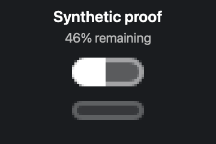
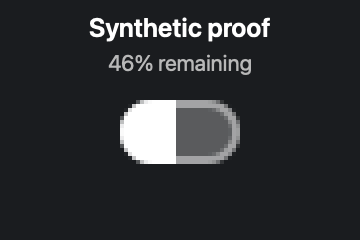

# Codex single-quota icon proof

These screenshots use a fixed synthetic input: `46% remaining`, with no secondary quota and no credits.
They contain only pixels from `IconRenderer` plus the generic labels shown in the cards. No live provider,
account, Keychain, desktop, username, email, or filesystem data is read or displayed.

| Before | After |
| --- | --- |
|  |  |

The before image was rendered from upstream commit `27c7f334e3c46c96ff8c063afbe0c7944ba5e0b7` with
`style: .codex`. The after image was rendered from this branch with `style: .combined` and
`quotaLayoutPolicy: .provider(.codex)`, matching the merged-menu dispatch path. The old renderer did not
accept an explicit quota-layout policy; with critters hidden, its relevant single-quota geometry was the same
for `.codex` and `.combined`.

Generate the after proof with:

```sh
CODEXBAR_ICON_SCREENSHOT_DIR=docs/screenshots \
  swift test --filter IconRendererScreenshotRenderTests
```

The opt-in screenshot test is skipped during normal test runs.
